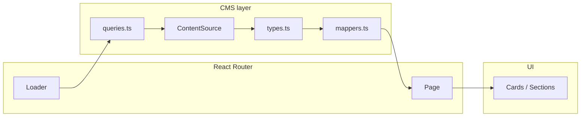

# Component_Map.md

# RoseJS Website — Component Map

**Status:** Complete (TASK-070)  
**Last updated:** June 2026  
**Related:** `docs/Architecture.md`, `docs/Tasks.md`, `src/app/routes.tsx`, `src/cms/types.ts`

This document maps reusable UI components to pages, props, and CMS data. It supports implementation, code review, and AI-assisted changes without reading every file.

---

## 1. Layer overview

```text
main.tsx
  └── App.tsx (RouterProvider)
        └── RootLayout          ← global shell (header, footer, analytics, org JSON-LD)
              └── Page routes   ← pages in src/pages/
                    ├── SEO / JsonLd
                    ├── Section components (marketing blocks)
                    ├── Card components (list teasers)
                    └── UI primitives (Container, LinkButton, …)

Data path (CMS-backed routes):
  route loader (src/app/cmsLoaders.ts)
    → queries (src/cms/queries.ts)
      → CmsContentSource (src/cms/client.ts → fallback or future Sanity)
        → normalized types (src/cms/types.ts)
          → mappers (src/cms/mappers.ts) → card/section props
```



---

## 2. Global shell (every page)

| Component | Path | Responsibility | Props / data |
| --------- | ---- | -------------- | ------------ |
| **RootLayout** | `src/app/RootLayout.tsx` | Wraps all routes; renders header, main outlet, footer | None; child routes via `<Outlet />` |
| **Header** | `src/components/layout/Header.tsx` | Site chrome; logo → `/`; desktop nav | Uses **Navigation**, **MobileNavigation** |
| **Navigation** | `src/components/layout/Navigation.tsx` | Desktop primary nav | `PRIMARY_NAV_ITEMS` from `navConfig.ts` |
| **MobileNavigation** | `src/components/layout/MobileNavigation.tsx` | Hamburger menu, focus trap, Escape to close | `PRIMARY_NAV_ITEMS` |
| **Footer** | `src/components/layout/Footer.tsx` | Secondary nav + copyright | `FOOTER_NAV_ITEMS` |
| **PageLayout** | `src/components/layout/PageLayout.tsx` | `<main>` landmark wrapping page content | `children` |
| **PlausibleLoader** | `src/components/analytics/PlausibleLoader.tsx` | Injects Plausible script when `VITE_PLAUSIBLE_DOMAIN` set | Env only |
| **JsonLd** (org) | `src/components/seo/StructuredData.tsx` | Organization graph on all pages | `organizationGraphSchema()` from `siteSchemas.ts` |

**Navigation config** (`src/components/layout/navConfig.ts`):

| Nav set | Items |
| ------- | ----- |
| Primary (header) | Services, About, Insights, Schedule |
| Footer | Services, About, Insights, Case Studies, Schedule, Contact |

Logo text **RoseJS** in **Header** links to `/` (no separate “Home” nav item).

---

## 3. UI primitives (`src/components/ui/`)

| Component | Responsibility | Key props |
| --------- | -------------- | --------- |
| **Container** | Max-width horizontal padding wrapper | `className`, `children` |
| **Section** | Vertical section spacing (optional eyebrow/title) | Section layout props |
| **Button** | Native `<button>` with variants | `variant`, `type`, `disabled`, `children` |
| **LinkButton** | Internal `<Link>` or external `<a>` styled as button | `to` *or* `href`, `variant`, `target`, `rel`, `onClick` |
| **Badge** | Small label chip | `children`, `className` |

Pages and sections should prefer **LinkButton** / **Button** over ad-hoc styled links for consistent focus and variants.

---

## 4. SEO & structured data (`src/components/seo/`)

| Component | Responsibility | Key props / data |
| --------- | -------------- | ---------------- |
| **SEO** | Client-side `<title>`, meta description, OG/Twitter tags | `title`, `description?`, `path?`, `ogImage?`, `ogType?` (`website` \| `article`) |
| **JsonLd** | Injects `<script type="application/ld+json">` | `data: Record<string, unknown>` |
| **siteSchemas** | Builders for Organization, BlogPosting, etc. | CMS entities (`BlogPost`, …) |

**Convention:** Every public page renders **SEO** with a unique `title`, `description`, and `path`. Article/detail pages pass `ogType="article"` and CMS `seo.*` fields when available.

---

## 5. Cards (`src/components/cards/`)

All list cards compose **MarketingCardLayout** (title, summary, CTA link).

| Component | Responsibility | Props | CMS source |
| --------- | -------------- | ----- | ---------- |
| **ServiceCard** | Service teaser on `/services` | `title`, `summary`, `to`, `ctaLabel?` | `mapServiceToServiceCardProps(Service)` |
| **BlogCard** | Article teaser on `/insights` | `title`, `summary`, `to`, `metaLine?`, `tagLabels?` | `BlogPost` + `formatBlogPostMetaLine` |
| **CaseStudyCard** | Case study teaser | `title`, `summary`, `to` | `mapCaseStudyToCaseStudyCardProps(CaseStudy)` |

---

## 6. Sections (`src/components/sections/`)

Reusable marketing blocks. Shared CTA shapes live in **`types.ts`** (`SectionCta`, `SectionCtaInternal`, `SectionCtaExternal`).

| Component | Responsibility | Key props | Used on |
| --------- | -------------- | --------- | ------- |
| **Hero** | Page hero with optional eyebrow and CTAs | `title`, `subtitle?`, `primaryCta?`, `secondaryCta?`, `showEyebrow?` | **Home** |
| **ServicesOverview** | Grid of service teasers + optional footnote + CTAs | `eyebrow`, `title`, `description`, `services[]`, `footnote?`, `ctas` | **Home** |
| **MethodologySection** | Pillar grid (AI-first delivery) | `eyebrow`, `title`, `description`, `pillars[]` | **Home** |
| **TrustSection** | Bullet list of trust points | `title`, `points[]`, `compact?` | **Home** |
| **CTASection** | Closing CTA band | `eyebrow`, `title`, `description`, `ctas` | **Home**, **Services** |
| **CtaRow** | Renders `SectionCta[]`; fires Plausible events for Calendly/lead-magnet links | `ctas` | Used inside Hero, CTASection, ServicesOverview, etc. |
| **FeaturedInsights** | Insights teaser grid | `eyebrow`, `title`, `description`, `insights[]`, `ctas?` | *Not mounted* (available for future home layout) |
| **LeadMagnetSection** | PDF/download CTA block | `title`, `description`, `downloadHref`, `ctaLabel`, `footnote?` | *Not mounted*; CMS `LeadMagnet` exists in fallback |

**Home** also uses **inline constants** for methodology pillars and trust points (not CMS-driven in MVP).

---

## 7. Forms (`src/components/forms/`)

| Component | Responsibility | Props / env |
| --------- | -------------- | --------- |
| **ContactForm** | Contact inquiry with validation, honeypot, optional Formspree POST | `VITE_FORM_ENDPOINT`; local state only. Fields: name, email, company, service interest, message. Emits `trackEvent('contact_submit', …)` on success. |

No props — page embeds `<ContactForm />` directly.

---

## 8. Library modules (`src/lib/`)

Not React components; isolated integration logic (Architecture §19.3).

| Module | Responsibility | Config |
| ------ | -------------- | ------ |
| **analytics.ts** | `trackEvent(name, props?)` → Plausible custom events | `VITE_PLAUSIBLE_DOMAIN` |
| **calendly.ts** | `getCalendlyUrl()`, `getCalendlyEmbedSrc()`, embed flag | `VITE_CALENDLY_URL`, `VITE_CALENDLY_EMBED` |
| **site.ts** | `getSiteOrigin()`, `getContactEmail()`, `getLinkedInUrl()` | `VITE_SITE_URL`, `VITE_CONTACT_EMAIL`, `VITE_LINKEDIN_URL` |
| **seo.ts** | `absoluteUrl()`, default site description | `VITE_SITE_URL` |

---

## 9. CMS layer (`src/cms/`)

Pages **must not** import Sanity/GROQ directly. Use loaders + types.

| Module | Role |
| ------ | ---- |
| **types.ts** | `Service`, `BlogPost`, `CaseStudy`, `LeadMagnet`, shared `SeoFields`, `Author`, `Tag`, `Category` |
| **client.ts** | `CmsContentSource` interface; `createContentSource()` factory |
| **fallbackContentSource.ts** | MVP static content from `src/content/fallback/*` |
| **queries.ts** | `getServices()`, `getBlogPostBySlug()`, etc. |
| **mappers.ts** | CMS → card/section prop shapes |

### CMS entity → route usage

| Entity | List route | Detail route | Fields used on detail |
| ------ | ---------- | ------------ | --------------------- |
| **Service** | `/services` | `/services/:slug` | `summary`, `problemSolved`, `description`, `businessOutcome`, `deliverables`, `seo`, relations → insights & case studies |
| **BlogPost** | `/insights` | `/insights/:slug` | `body`, `author`, dates, `tags`, `category`, `seo`, `relatedServiceSlugs` |
| **CaseStudy** | `/case-studies` | `/case-studies/:slug` | `problem`, `context`, `approach`, `solution`, `outcome`, `lessonsLearned`, `seo`, relations |
| **LeadMagnet** | — | — | Loaded via `getLeadMagnets()`; not wired to a page in current home layout |

---

## 10. Route loaders (`src/app/cmsLoaders.ts`)

| Loader | Route | Returns | Mapper / notes |
| ------ | ----- | ------- | -------------- |
| `homePageLoader` | `/` | `{ servicesOverview }` | Three fixed slugs → `mapServiceToOverviewTeaser` |
| `servicesPageLoader` | `/services` | `{ cards }` | `mapServiceToServiceCardProps` × N |
| `serviceDetailLoader` | `/services/:slug` | `{ service, relatedPosts, relatedStudies }` | Filters by `related*Slugs` on `Service` |
| `insightsPageLoader` | `/insights` | `{ posts }` | Full `BlogPost[]` |
| `blogArticleLoader` | `/insights/:slug` | `{ post, relatedServices }` | Related service titles/slugs |
| `caseStudiesPageLoader` | `/case-studies` | `{ cards }` | `mapCaseStudyToCaseStudyCardProps` × N |
| `caseStudyDetailLoader` | `/case-studies/:slug` | `{ study, relatedServices }` | Full `CaseStudy` + related services |

Routes **without** loaders (static copy in page file): `/about`, `/contact`, `/schedule`, `*` (404).

---

## 11. Page-to-component mapping

| Route | Page file | Loader | Components & patterns |
| ----- | --------- | ------ | --------------------- |
| `/` | `Home.tsx` | `homePageLoader` | **SEO**, **Hero**, **ServicesOverview**, **MethodologySection**, **TrustSection**, **CTASection** |
| `/services` | `Services.tsx` | `servicesPageLoader` | **SEO**, **Container**, **ServiceCard** × N, **CTASection** |
| `/services/:slug` | `ServiceDetail.tsx` | `serviceDetailLoader` | **SEO**, **Container**, inline sections (problem, outcomes, deliverables), **LinkButton**, related link lists |
| `/about` | `About.tsx` | — | **SEO**, **Container**, **LinkButton** → `/schedule` |
| `/insights` | `Insights.tsx` | `insightsPageLoader` | **SEO**, **Container**, **BlogCard** × N or empty state |
| `/insights/:slug` | `BlogArticle.tsx` | `blogArticleLoader` | **SEO**, **JsonLd** (BlogPosting), **Container**, body paragraphs, related services |
| `/case-studies` | `CaseStudies.tsx` | `caseStudiesPageLoader` | **SEO**, **Container**, **CaseStudyCard** × N or empty state |
| `/case-studies/:slug` | `CaseStudyDetail.tsx` | `caseStudyDetailLoader` | **SEO**, **Container**, structured sections, related services |
| `/contact` | `Contact.tsx` | — | **SEO**, **ContactForm**, aside cards (**LinkButton**, mailto, optional LinkedIn) |
| `/schedule` | `Schedule.tsx` | — | **SEO**, **Container**, **LinkButton** (Calendly), optional Calendly **iframe** via `lib/calendly.ts` |
| `*` | `NotFound.tsx` | — | **SEO**, **Container**, link home |

---

## 12. Analytics events (component touchpoints)

| Event | Triggered from |
| ----- | -------------- |
| `calendly_click` | **Schedule** page, **Contact** schedule aside, **CtaRow** (external Calendly href), internal `/schedule` nav |
| `contact_submit` | **ContactForm** successful submit |
| `lead_magnet_download` | **CtaRow** when `href` matches lead-magnet path (e.g. `/downloads/…`) |

---

## 13. Tests co-located with components

| Area | Test files |
| ---- | ---------- |
| Layout | `Header.test.tsx`, `Navigation.test.tsx` |
| UI | `Button.test.tsx`, `LinkButton.test.tsx` |
| Cards | `ServiceCard.test.tsx`, `BlogCard.test.tsx`, `CaseStudyCard.test.tsx` |
| Forms | `ContactForm.test.tsx` |
| Sections | `LeadMagnetSection.test.tsx` |
| Lib | `analytics.test.ts`, `site.test.ts`, `seo.test.ts` |
| E2E | `e2e/navigation.spec.ts`, `e2e/contact-form.spec.ts`, `e2e/launch-smoke.spec.ts`, … |

---

## 14. Adding a new page (checklist)

1. Add route + optional loader in `src/app/routes.tsx` / `cmsLoaders.ts`.
2. Create page under `src/pages/`; render **SEO** with unique metadata.
3. Prefer existing **sections** / **cards**; extend **mappers** for new CMS shapes.
4. Update `public/sitemap.xml` and E2E smoke routes if public.
5. Update this map and `docs/Traceability_Matrix.md` when IA changes.

---

## 15. Future CMS (Sanity)

When `VITE_SANITY_PROJECT_ID` is set, implement `CmsContentSource` in a new module (e.g. `sanityContentSource.ts`) and return it from `createContentSource()`. **Do not** change page components or loader return shapes—only the data source behind `queries.ts`.

---

*Canonical path: `docs/Component_Map.md` (TASK-070).*
